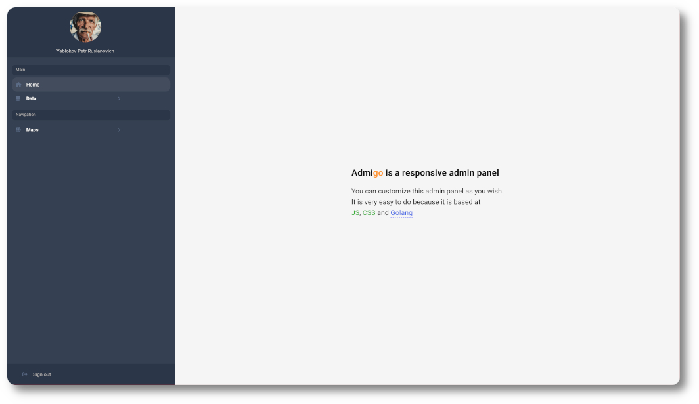

<h1 align="center">
  
  <br />
  Admigo
  <br />
</h1>
<h4 align="center">
This is a web server featuring a reference implementation of an admin panel
</h4>
<p align="center">

<a href="https://sourcegraph.com/github.com/opaldone/admigo?badge">
  
</a>
</p>
<br />

<h3>
Built with these excellent libraries

</h3>

* [gorilla-csrf](https://github.com/gorilla/csrf)
* [julienschmidt-httprouter](https://github.com/julienschmidt/httprouter)
* [acme-autocert](https://pkg.go.dev/golang.org/x/crypto/acme/autocert)

_It doesn't depend on any JavaScript or CSS frameworks; it uses only vanilla JavaScript and pure CSS._
<h1></h1>

### How to install and compile
##### Clonning
```bash
git clone https://github.com/opaldone/admigo.git
```
##### Go to the root "admigo" directory
```bash
cd admigo
```
##### Set your GOPATH to the "admigo" directory to keep your global GOPATH clean
```bash
export GOPATH=$(pwd)
```
##### Go to the source folder
```bash
cd src/admigo
```
##### Installing the required Golang packages
```bash
go mod init
```
```bash
go mod tidy
```
##### Return to the "admigo" root directory, You can see the "admigo/pkg" folder that contains the required Golang packages
```bash
cd ../..
```
##### Compiling by the "r" bash script
> r - means "run", b - means "build"
```bash
./r b
```
##### Creating the required folders structure and copying the frontend part by the "u" bash script
> The "u" script is a watching script then for stopping press Ctrl+C \
> u - means "update"
```bash
./u
```
> The "u" script reads sub file "watch_files" \
> E_FOLDERS - the array of creating empty folders \
> C_FOLDERS - the array of folders to simple copy \
> W_FILES - the array of files whose changes are tracked
```bash
./watch_files
```
##### You can check the "admigo/bin" folder. It should contain the necessary structure of folders and files
```bash
ls -lash --group-directories-first bin
```
##### Start the server
```bash
./r
```
### About config
The config file is located here __admigo/bin/config.json__
```JavaScript
{
  // Just a name of application
  "appname": "admigo",

  // IP address of the server, zeros mean current host
  "address": "0.0.0.0",

  // Port, don't forget to open it in the firewall
  "port": 8443,

  // The folder that stores the frontend part of the site
  "static": "static",

  // Set "acme": true if You need to use acme/autocert
  // false - if You use self-signed certificates
  "acme": false,

  // The array of domain names, set "acme": true
  "acmehost": [
    "opaldone.su",
    "206.189.101.23",
    "www.opaldone.su"
  ],

  // The folder where acme/autocert will store the keys, set "acme": true
  "dirCache": "./certs",

  // The paths to your self-signed HTTPS keys, set "acme": false
  "crt": "./certs_local/server.crt",
  "key": "./certs_local/server.key",

  // Language of the site
  "lang": "en",

  // Settings of db connection
  "db": {
    "host": "localhost",
    "driver": "postgres",
    "user": "user_login",
    "password": "user_password",
    "dbname": "admigo_db",
    "sslmode": "disable"
  },

  // Settings of the mail handler
  "mail": {
    "from": "some_user@some_site.com",
    "host": "smtp.site.com",
    "password": "email_password",
    "port": 465,
    "username": "user_name@some_site.com",

    // URL of the your site
    "gotourl": "https://opaldone.su:8443"
  }

  // Settings of the map handler
  "map": {
    // URL for the web socket to exchange location positions
    "ws": "wss://admigo.so:8088",

    // Start point of map focus
    "startpoint": "51.76358, -0.45707",

    // URL of the service to make routers
    "routeurl": "https://api.openrouteservice.org/v2/directions/driving-car/geojson",

    // URL key for api.openrouteservice.org
    "routekey": "xxx",

    // The city to search addresses
    "city": "London",

    // The language used in addresses
    "lang": "en"
  }
}
```

### Screenshots
[](assets/imgs/i1.png)

### License
MIT License - see [LICENSE](LICENSE) for full text
